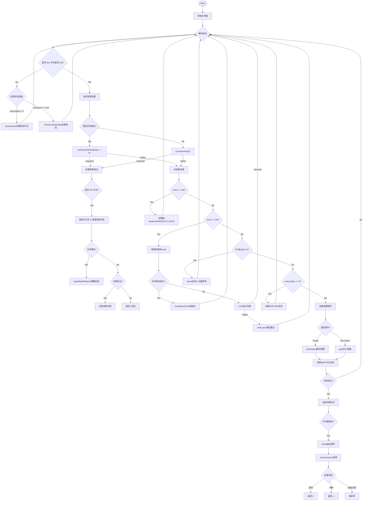

```mermaid
flowchart TD
    A([Start]) --> B[初始化参数]
    B --> C{循环尝试}
    C --> D1{是否 first 节点或未入队?}
    D1 -- Yes --> E1[尝试获取资源]
    D1 -- No --> D2{前驱状态检查}
    D2 -- pred.status < 0 --> D3[cleanQueue清理取消节点]
    D3 --> C
    D2 -- pred.prev == null --> D4[Thread.onSpinWait自旋等待]
    D4 --> C

    E1 --> F{是否共享模式?}
    F -- Yes --> G["tryAcquireShared(arg) >= 0?"]
    F -- No --> H["tryAcquire(arg)?"]
    G -- Acquired --> I1[处理获取成功]
    H -- Acquired --> I1[处理获取成功]
    I1 --> I2{是否 first 节点?}
    I2 -- Yes --> I3[更新头节点 & 清理线程引用]
    I3 --> I4{共享模式?}
    I4 -- Yes --> I5[signalNextIfShared唤醒后继]
    I4 -- No --> I6{中断标记?}
    I6 -- Yes --> I7[当前线程中断]
    I6 -- No --> I8[返回 1成功]
    G -- Failed --> J[未获取资源]
    H -- Failed --> J[未获取资源]

    J --> K{node == null?}
    K -- Yes --> K1[创建新NodeSHARED/EXCLUSIVE]
    K1 --> C
    K -- No --> L{pred == null?}
    L -- Yes --> L1[绑定线程到node]
    L1 --> L2{队列未初始化?}
    L2 -- Yes --> L3[tryInitializeHead初始化]
    L3 --> C
    L2 -- No --> L4[CAS加入队尾]
    L4 -- Failed --> L5[node.prev置空重试]
    L5 --> C
    L4 -- Success --> C
    L -- No --> M{first且spins>0?}
    M -- Yes --> M1[spins自减 & 自旋等待]
    M1 --> C
    M -- No --> N{node.status == 0?}
    N -- Yes --> N1[设置WAITING状态]
    N1 --> C
    N -- No --> O[线程阻塞操作]
    O --> P{是否超时?}
    P -- Timed --> P1[parkNanos限时阻塞]
    P -- Not Timed --> P2[park永久阻塞]
    P1 --> Q[清除WAITING状态]
    P2 --> Q[清除WAITING状态]
    Q --> R{中断发生?}
    R -- Yes --> R1[记录中断标记]
    R1 --> S{可中断模式?}
    S -- Yes --> T[break退出循环]
    R -- No --> C

    T --> U[cancelAcquire处理]
    U --> V{结果判断}
    V -- 超时 --> V1[返回 0]
    V -- 中断 --> V2[返回 -1]
    V -- 其他异常 --> V3[抛异常]
```