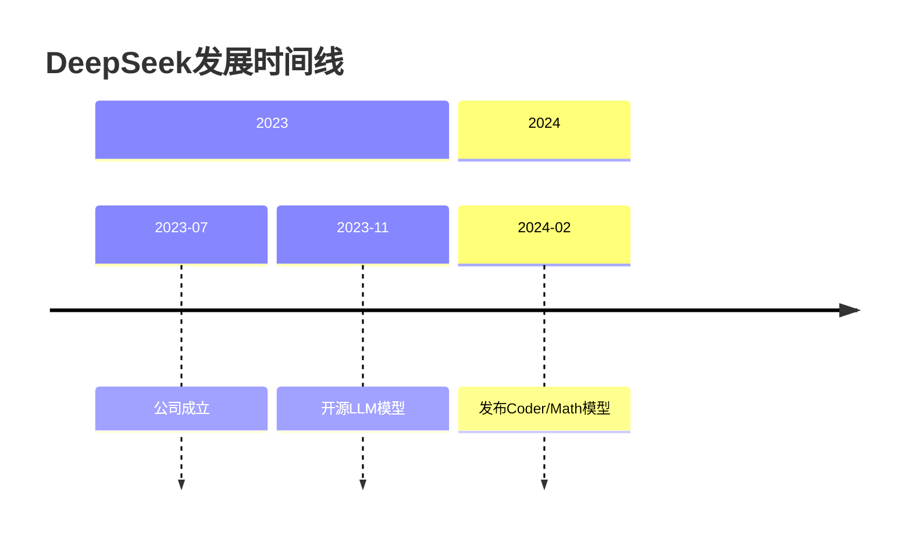
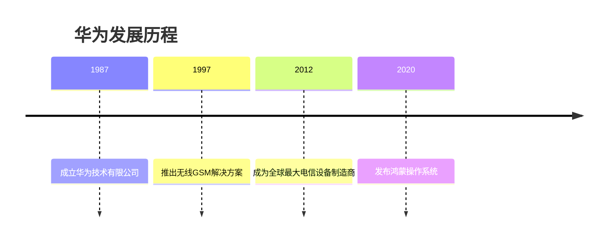
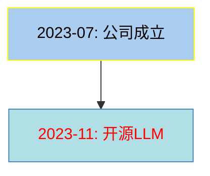
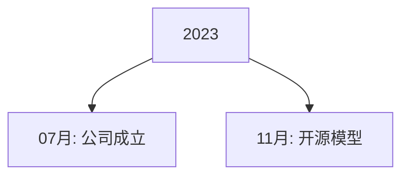
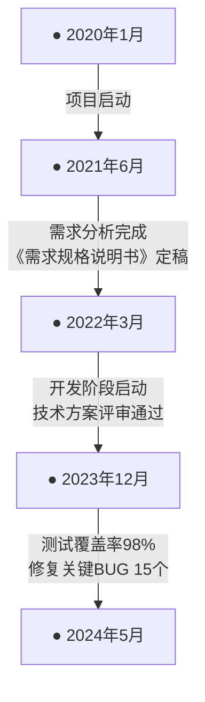
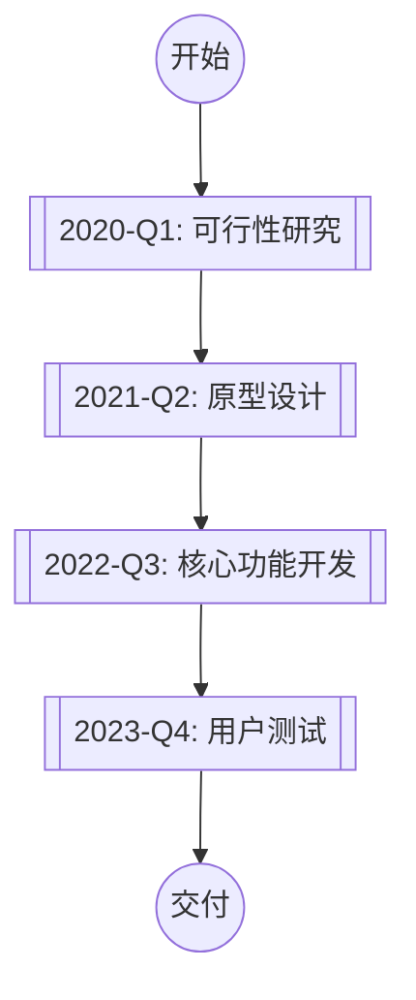

```mermaid
timeline
    title DeepSeek发展时间线
    section 2023
      2023-07 : 公司成立
      2023-11 : 开源LLM模型
    section 2024
      2024-02 : 发布Coder/Math模型
```

##

```mermaid
timeline
    title 华为发展历程
    1987 : 成立华为技术有限公司
    1997 : 推出无线GSM解决方案
    2012 : 成为全球最大电信设备制造商
    2020 : 发布鸿蒙操作系统
```
##

```mermaid
graph TD
    A[2023-07: 公司成立]:::foundation --> B[2023-11: 开源LLM]:::tech
    classDef foundation fill:#ABCDEF,stroke:yellow,color:#000000
    classDef tech fill:#B0E0E6,stroke:#4682B4,color:red
```
* classDef 定义了节点的样式。
* fill 定义了节点的填充色。
* stroke 定义了节点的边框色。
* color 定义了节点的文本颜色。

##

```mermaid
graph TD
    section_2023[2023] --> event1[07月: 公司成立]
    section_2023 --> event2[11月: 开源模型]
```
## 

```mermaid
graph TB
    T1["● 2020年1月"] -- "项目启动" --> T2["● 2021年6月"]
    T2 -- "需求分析完成<br>《需求规格说明书》定稿" --> T3["● 2022年3月"]
    T3 -- "开发阶段启动<br>技术方案评审通过" --> T4["● 2023年12月"]
    T4 -- "测试覆盖率98%<br>修复关键BUG 15个" --> T5["● 2024年5月"]
```
##

```mermaid
graph TB
    Start(("开始")) --> Phase1[[2020-Q1: 可行性研究]]
    Phase1 --> Phase2[[2021-Q2: 原型设计]]
    Phase2 --> Phase3[[2022-Q3: 核心功能开发]]
    Phase3 --> Phase4[[2023-Q4: 用户测试]]
    Phase4 --> End(("交付"))
```
* (()) 表示圆形节点（起止点）。
* [[]] 表示圆角矩形（阶段里程碑）。