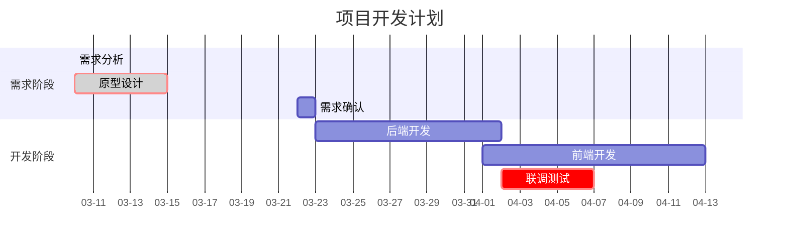
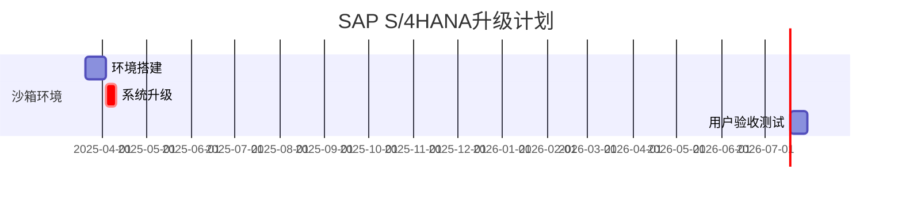
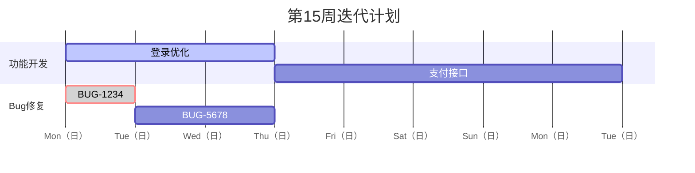

gantt关键字定义甘特图，核心元素包括标题、日期格式、任务分组和任务属性。

* title：图表标题，用于描述项目整体目标。
* dateFormat：定义任务日期的输入格式（如 YYYY-MM-DD）。
    * YYYY：4位数年份
    * YY: 2位数年份
    * MM：补0月份
    * M: 非补0月份
    * DD：补0日期
    * M: 非补0月份
    * HH: 24小时制小时
    * hh: 12小时制小时
    * mm: 分钟
    * ss: 秒
* axisFormat：调整时间轴显示格式（如 %m-%d 显示为月-日）。
    * %Y：4位数年份
    * %y: 2位数年份
    * %m: 2位数月份
    * %b: 英文三字母月份，首字母大写。如Jan, Feb
    * %B：英文完整月份，首字母大写。如January, February
    * %d：补0日期
    * %e：非补0日期
    * %w：周
    * %a：英文三字母周几, 首字母大写。如Mon, Tue
    * %A：英文完整周几，首字母大写。如Monday, Tuesday
    * %H：24小时制小时
    * %I：12小时制小时
    * %M：补0分钟
    * %S：补0秒
    * %l：12小时制小时
    * %p: AM/PM, 上午/下午标记
    * %U：一年中的第几周,补0两位数
    * %j：一年中的第几天,补0三位数
    * %Q：季度
* section：分组任务模块（如需求阶段、开发阶段）。secion中每个任务定义包含6部分，格式为:
    > 任务描述: 任务状态(可缺失), 关键任务标记(可缺失) 任务ID, 任务开始日期|任务依赖, 任务执行时长

    * 任务状态
        * done：已完成的任务（绿色填充）
        * active：进行中的任务（蓝色渐变）
        * 默认状态：未开始（灰色）
    * 关键任务
        * crit：标记关键任务（红色高亮显示）,如果同时设置任务状态，则仅边框显示为红色。
    * 任务开始日期
        * 格式要与dateFormat一致
    * 任务依赖
        * after: 任务依赖，自动调整时间线
    * 任务执行时长
        * 支持单位d、w、m、y. 1d:1天,2w:2周,3m:3月,4y:4年

* %%{init: {'theme': 'base', 'gantt': {'displayMode': 'compact'}} }%% ​紧凑模式, 减少图表高度d

##

# 示例

##

